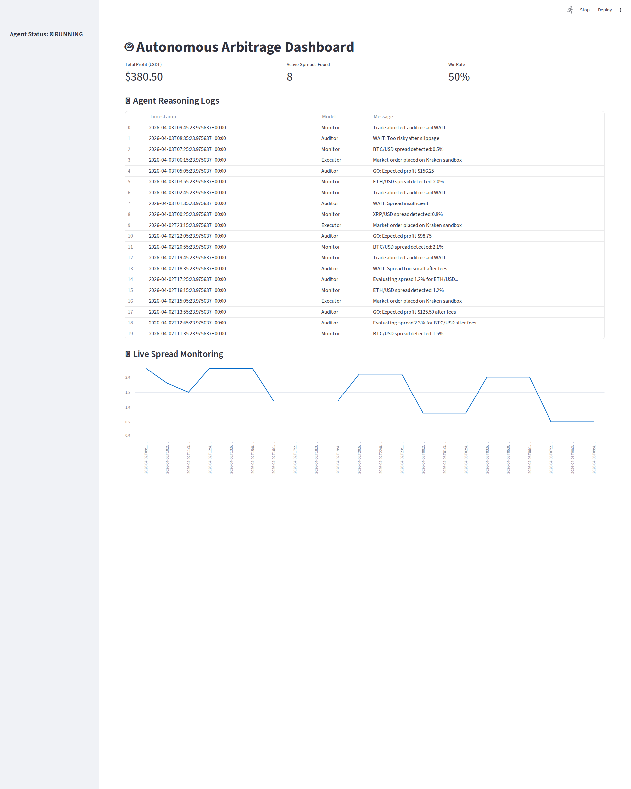

# Autonomous Delta-Neutral Arbitrageur

Autonomous Delta-Neutral Arbitrageur is an AI-assisted crypto arbitrage agent. It monitors cross-exchange spreads, asks an auditor model for a GO/WAIT decision, optionally executes a sandbox trade, and logs every decision to SQLite for live dashboard monitoring.

## 🚀 Core Technologies

- **Language:** Python 3.12+
- **Project Manager:** `uv`
- **Domain:** Quantitative Finance / Crypto Arbitrage

## ✨ Features

- **Real-time spread monitoring:** Pulls prices for configured symbols from Binance US, Coinbase, and Kraken using CCXT.
- **Agent workflow with gated execution:** Uses a LangGraph flow with monitor -> auditor -> executor steps.
- **AI audit before trade:** Auditor LLM evaluates whether a spread is still profitable after fees and returns GO or NO-GO.
- **Sandbox execution path:** Places demo market orders on Kraken sandbox when audit passes.
- **Persistent event logging:** Stores monitor, audit, and execution events in SQLite for traceability.
- **Live command-center dashboard:** Streamlit UI shows P/L, win rate, logs, and spread trends.
- **Automated quality checks:** Pytest + Ruff + CI security checks (Bandit and pip-audit).

## 🧭 Current Architecture

- **Core runtime:** [src/main.py](src/main.py)
- **Database and logging helpers:** [src/db.py](src/db.py)
- **Dashboard app:** [src/dashboard.py](src/dashboard.py)
- **Test suite:** [tests](tests)

The runtime loop executes these stages:

1. **Monitor:** Fetches exchange tickers and calculates max spread percentage.
2. **Audit:** Sends latest prices to the auditor model for GO/WAIT.
3. **Execute:** If GO, places sandbox order and logs estimated profit.
4. **Observe:** Dashboard reads logged events and visualizes recent behavior.

## 📊 Dashboard Preview



The live dashboard displays:

- **Total Profit (USDT)**: Cumulative profits from executed trades
- **Active Spreads Found**: Number of profitable opportunities detected
- **Win Rate**: Percentage of executed trades vs total attempted trades
- **Agent Reasoning Logs**: Real-time logs from Monitor, Auditor, and Executor components
- **Live Spread Monitoring**: Time-series chart showing spread percentages over time

## 🏁 Getting Started

### Prerequisites

- Python 3.12+
- `uv` package manager

### Installation

1. **Clone the repository:**

    ```bash
    git clone https://github.com/your-username/Autonomous_Delta-Neutral_Arbitrageur.git
    cd Autonomous_Delta-Neutral_Arbitrageur
    ```

2. **Create and activate the virtual environment:**

    ```bash
    uv venv
    source .venv/bin/activate
    ```

3. **Install dependencies:**

    ```bash
    uv sync
    ```

### Configuration

1. Create a `.env` file from the example:

    ```bash
    cp .env.example .env
    ```

2. Add your exchange API keys and any other required environment variables to the `.env` file.

### Running the Bot

- **Run the trading agent:**

    ```bash
    uv run adna
    ```

    or

    ```bash
    uv run python src/main.py
    ```

- **Run the dashboard:**

    ```bash
    uv run streamlit run src/dashboard.py
    ```

## 🛠️ DevOps Runbook

### Containerized local deployment

- **Build image:**

    ```bash
    docker build -t adna:local .
    ```

- **Run agent only (compose profile):**

    ```bash
    docker compose --profile agent up --build
    ```

- **Run dashboard only (compose profile):**

    ```bash
    docker compose --profile dashboard up --build
    ```

- **Run full stack (agent + dashboard):**

    ```bash
    docker compose --profile full up --build
    ```

### Deployment confidence checklist

1. Validate formatting and lint checks pass.
2. Run tests with coverage threshold.
3. Run dependency and security audits.
4. Verify entrypoint smoke test for `adna`.

### Operational commands

- **Stop compose services:**

    ```bash
    docker compose down
    ```

- **Follow agent logs:**

    ```bash
    docker compose logs -f agent
    ```

- **Follow dashboard logs:**

    ```bash
    docker compose logs -f dashboard
    ```

### Incident triage quickstart

1. Confirm `.env` has required API credentials.
2. Check recent agent logs for `trade_execution_failed` and `dashboard_data_load_failed` events.
3. Use `run_id` and `cycle_id` from logs to correlate monitor, auditor, and executor actions within the same cycle.
4. Check `metrics_summary` log lines for aggregate wait, executed, failed, and aborted counts plus average cycle/audit/execution latency.
5. Re-run security and dependency checks locally:

    ```bash
    uv run --with pip-audit pip-audit --ignore-vuln CVE-2026-4539
    uv run --with bandit bandit -q -r src
    ```

## 🧪 Testing

This project follows Test-Driven Development (TDD).

- **Run all tests:**

    ```bash
    uv run pytest
    ```

- **Run a specific test file:**

    ```bash
    uv run pytest tests/test_prices.py
    ```

- **Run tests with verbose output:**

    ```bash
    uv run pytest -v
    ```

## 🤝 Contributing

Contributions are welcome! Please feel free to submit a pull request or open an issue.

## 📄 License

This project is licensed under the MIT License. See the `LICENSE.md` file for details.
